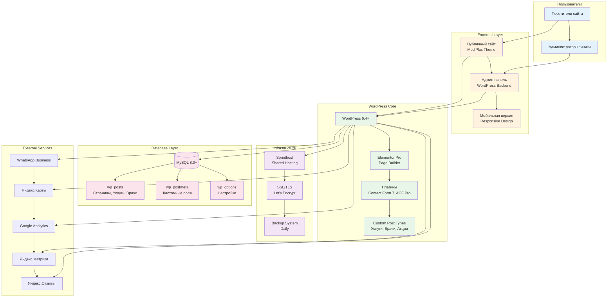
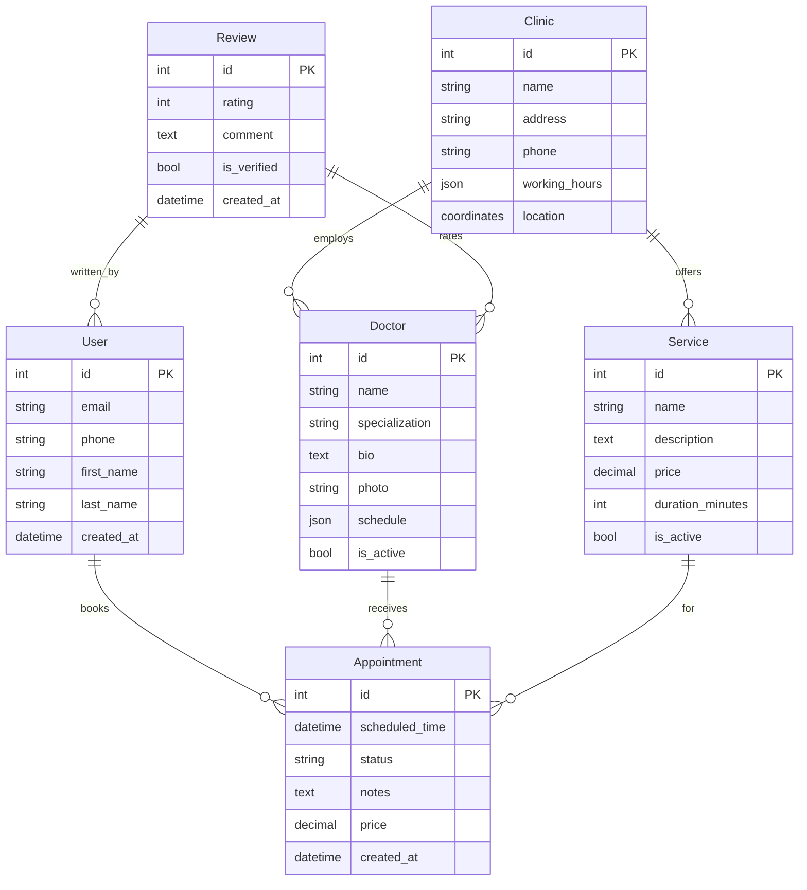

# 🏗️ Архитектура системы

## ⚡ ТЕКУЩЕЕ РЕШЕНИЕ: WordPress

**Статус:** ✅ Выбрано для реализации (октябрь 2025)

После анализа требований клиента принято решение использовать **WordPress** вместо Django/Wagtail:

### Почему WordPress?
- ✅ **Простота управления** - визуальный редактор Elementor Pro
- ✅ **Быстрый запуск** - 8 дней вместо 45
- ✅ **Доступная цена** - от 250,000₽ вместо 800,000₽
- ✅ **Нет онлайн-записи** - клиент отказался от сложного функционала
- ✅ **Низкий порог входа** - клиент не знаком с CMS

📖 **Детальная архитектура:** [WordPress Architecture](/technical/wordpress-architecture/)  
📊 **Обоснование выбора:** [WordPress Solution](/technical/wordpress-solution/)  
💰 **Коммерческое предложение:** [Цены WordPress](/business/wordpress-pricing-simple/)

---

## 📦 WordPress Архитектура (кратко)

### 💻 Технический стек

| Компонент | Технология | Назначение |
|-----------|-----------|------------|
| **CMS** | WordPress 6.4+ | Система управления контентом |
| **Язык** | PHP 8.0+ | Серверный язык |
| **БД** | MySQL 8.0+ | Хранение данных |
| **Page Builder** | Elementor Pro | Визуальный редактор |
| **Тема** | MediPlus | Медицинская тема |
| **Хостинг** | Sprinthost | Shared hosting |

### 🎯 Основной функционал

- 8 страниц (Главная, О клинике, Услуги, Врачи, Акции, Новости, Отзывы, Контакты)
- Каталог услуг (22 позиции)
- Карточки врачей (3-4 специалиста)
- Формы обратной связи
- WhatsApp + Telegram интеграция
- Яндекс.Карты + Яндекс.Отзывы
- Google Analytics + Яндекс.Метрика
- SEO оптимизация

### ⏱️ Сроки и стоимость

- **Срок:** 8 дней
- **Цена:** от 250,000₽ до 350,000₽
- **Команда:** 6 человек (PM, Designer, Dev, Copywriter, QA, DevOps)

---

## 📚 АЛЬТЕРНАТИВНАЯ АРХИТЕКТУРА: Django/Wagtail

> **Примечание:** Эта архитектура была разработана для полнофункционального портала с онлайн-записью.  
> Клиент отказался от онлайн-записи, поэтому выбран WordPress как более простое и доступное решение.

### 🐍 Backend (не используется)
**Django-основанная архитектура с REST API для всех интеграций**

- Django 4.2+ (LTS)
- Django REST Framework
- Celery для задач
- Python 3.10+

### 📝 CMS (не используется)
**Wagtail CMS для управления контентом и структурой сайта**

- Wagtail 5.0+
- StreamField контент
- Многосайтовость
- Встроенные формы

### 🗄️ База данных (не используется)
**PostgreSQL как основная база с Redis для кеширования**

- PostgreSQL 14+
- Redis 7.0+
- Индексы для поиска
- Бэкапы и репликация

### 🎨 Frontend (не используется)
**Современный адаптивный интерфейс с прогрессивной загрузкой**

- HTML5/CSS3/ES6+
- Vue.js 3+ / Alpine.js
- Bootstrap 5.3+ / Tailwind
- Progressive enhancement

### 🚀 Инфраструктура (не используется)
**Масштабируемая инфраструктура с мониторингом и безопасностью**

- Nginx + Gunicorn
- SSL/TLS сертификаты
- Docker контейнеры
- Мониторинг (Sentry)

### 🔧 DevOps (не используется)
**Автоматизация развертывания и управления окружениями**

- GitHub Actions CI/CD
- Docker Compose
- Автоматические тесты
- Staging среда

## 📊 Диаграмма WordPress архитектуры

---

## 🔗 Внешние интеграции WordPress

### 📱 Мессенджеры
- **WhatsApp Business** - кнопка связи, виджет чата
- **Telegram** - кнопка связи, уведомления

### 🗺️ Карты и отзывы
- **Яндекс.Карты** - интерактивная карта с адресом клиники
- **Яндекс.Отзывы** - виджет отзывов на сайте

### 📊 Аналитика
- **Google Analytics 4** - анализ посещаемости
- **Яндекс.Метрика** - вебвизор, карты кликов, цели

### 📧 Email
- **WP Mail SMTP Pro** - надежная отправка писем через SMTP
- **Contact Form 7** - формы обратной связи

---

## 📚 Сравнение архитектур

| Параметр | WordPress ✅ | Django/Wagtail |
|----------|-------------|----------------|
| **Сложность** | Низкая | Высокая |
| **Срок разработки** | 8 дней | 45 дней |
| **Стоимость** | 250-350k₽ | 800k₽+ |
| **Управление контентом** | Визуальный редактор | Требует обучения |
| **Онлайн-запись** | Не требуется | Избыточно |
| **Поддержка** | Простая | Сложная |
| **Масштабируемость** | Средняя | Высокая |
| **Безопасность** | Хорошая | Отличная |

---

## 🎯 Рекомендации

### Для текущего проекта (клиника "Пчёлка"):
✅ **Используем WordPress**
- Простота управления для клиента
- Быстрый запуск (8 дней)
- Доступная цена (от 250,000₽)
- Нет необходимости в сложном функционале

### Когда использовать Django/Wagtail:
- Требуется онлайн-запись с календарем
- Нужна интеграция с медицинскими системами
- Высокие требования к безопасности данных
- Сложная бизнес-логика
- Большой бюджет (от 800,000₽)

---

## 📖 Дополнительная документация

- 📋 [Детальная архитектура WordPress](/technical/wordpress-architecture/)
- 📊 [Обоснование выбора WordPress](/technical/wordpress-solution/)
- 💰 [Коммерческое предложение](/business/wordpress-pricing-simple/)
- 📈 [Анализ бюджетного пакета](/business/wordpress-budget-analysis/)
- 🗺️ [Карта документации](/documentation-map/)

---

## 🛡️ Безопасность WordPress

### 🔒 Защита данных
- **HTTPS** - SSL/TLS сертификат Let's Encrypt
- **Wordfence Security** - файрвол, сканирование на вирусы
- **Регулярные бэкапы** - ежедневные автоматические копии
- **Двухфакторная аутентификация** - для админ-панели

### ⚖️ Соответствие законам
- **152-ФЗ** - политика обработки персональных данных
- **Cookie consent** - уведомление о cookies
- **Политика конфиденциальности** - на отдельной странице
- **Согласие на обработку** - в формах обратной связи

### 👁️ Мониторинг
- **Google Analytics 4** - посещаемость, поведение
- **Яндекс.Метрика** - вебвизор, карты кликов
- **Uptime monitoring** - проверка доступности сайта
- **Error logging** - логирование ошибок PHP

---

## 📋 ПРИЛОЖЕНИЕ: Django/Wagtail архитектура (reference)

> **Примечание:** Эта архитектура сохранена для справки.  
> Может быть использована в будущем при расширении функционала.

### 🏥 Модель данных Django (не используется)

### Когда потребуется Django:
- Добавление онлайн-записи
- Интеграция с медицинскими системами
- Личный кабинет пациента
- Сложная бизнес-логика
- Аудитируемые действия

## 📈 Производительность

### ⚡ Целевые показатели
- Время загрузки < 3 сек
- Uptime 99.5%
- PageSpeed Score 85+
- 500+ одновременных пользователей

### 🚀 Оптимизации
- Redis кеширование
- CDN для статики
- Lazy loading изображений
- Минификация CSS/JS