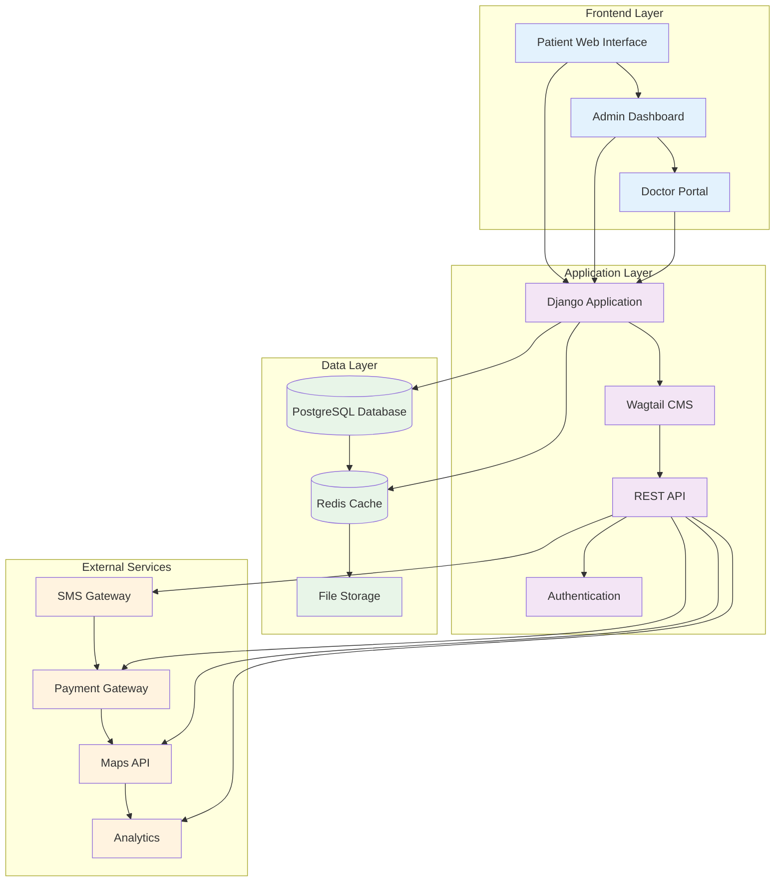
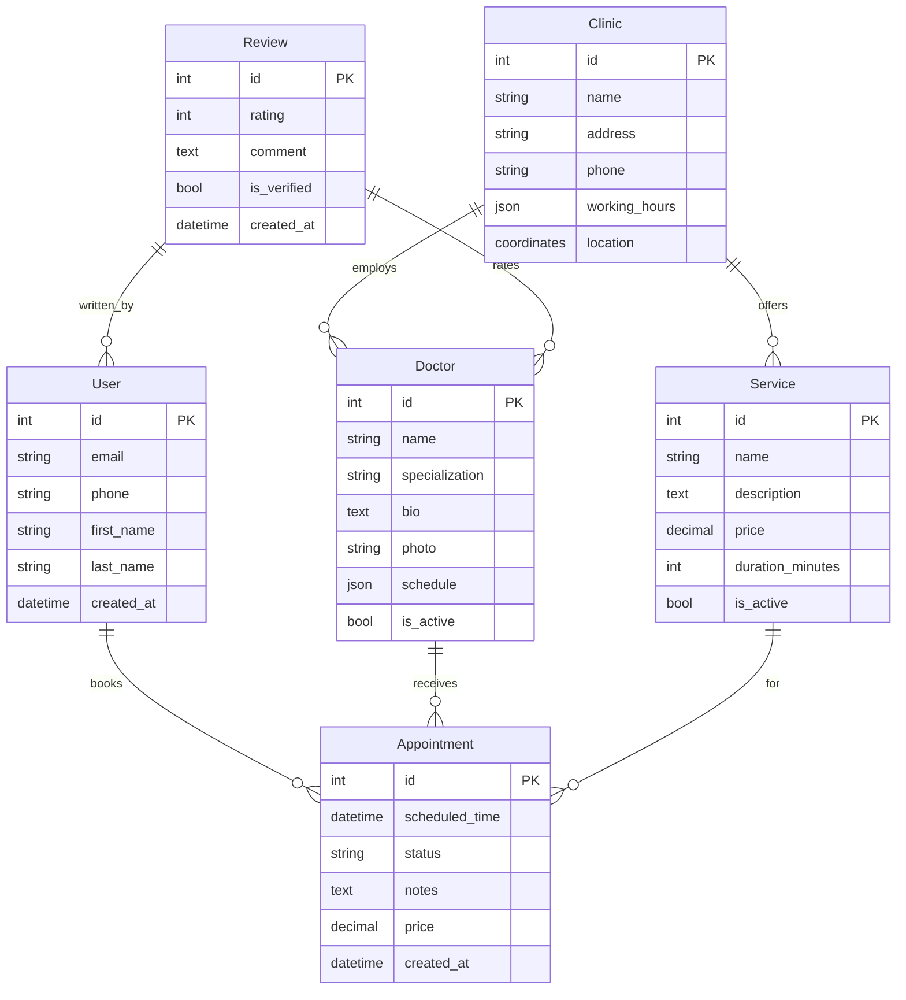

# 🏗️ Архитектура системы

## 🐍 Backend
**Django-основанная архитектура с REST API для всех интеграций**

- Django 4.2+ (LTS)
- Django REST Framework
- Celery для задач
- Python 3.10+

## 📝 CMS
**Wagtail CMS для управления контентом и структурой сайта**

- Wagtail 5.0+
- StreamField контент
- Многосайтовость
- Встроенные формы

## 🗄️ База данных
**PostgreSQL как основная база с Redis для кеширования**

- PostgreSQL 14+
- Redis 7.0+
- Индексы для поиска
- Бэкапы и репликация

## 🎨 Frontend
**Современный адаптивный интерфейс с прогрессивной загрузкой**

- HTML5/CSS3/ES6+
- Vue.js 3+ / Alpine.js
- Bootstrap 5.3+ / Tailwind
- Progressive enhancement

## 🚀 Инфраструктура
**Масштабируемая инфраструктура с мониторингом и безопасностью**

- Nginx + Gunicorn
- SSL/TLS сертификаты
- Docker контейнеры
- Мониторинг (Sentry)

## 🔧 DevOps
**Автоматизация развертывания и управления окружениями**

- GitHub Actions CI/CD
- Docker Compose
- Автоматические тесты
- Staging среда

## 📊 Диаграмма архитектуры

## 🔗 Внешние интеграции

### 📱 SMS уведомления
SMSC.ru, SMS.ru для отправки напоминаний

### 💳 Онлайн-платежи
ЮKassa, CloudPayments для приема оплаты

### 🗺️ Карты и геолокация
Яндекс.Карты API для навигации

### 📊 Аналитика
Google Analytics 4 + Яндекс.Метрика

### 📧 Email маркетинг
SendGrid, Mailchimp для рассылок

### 📞 CRM интеграция
API для связи с внешними CRM

## 🏥 Модель данных

## 🛡️ Безопасность и соответствие

### 🔒 Защита данных
- HTTPS everywhere
- Шифрование БД
- Двухфакторная аутентификация
- Регулярные бэкапы

### ⚖️ Соответствие законам
- GDPR compliance
- 152-ФЗ "О персональных данных"
- Cookie consent
- Политика конфиденциальности

### 👁️ Мониторинг
- Логирование всех действий
- Мониторинг производительности
- Алерты о сбоях
- Аудит безопасности

### 🏥 Медицинские данные
- Особая защита PHI
- Согласие на обработку
- Право на удаление
- Аудитируемые действия

## 📈 Производительность

### ⚡ Целевые показатели
- Время загрузки < 3 сек
- Uptime 99.5%
- PageSpeed Score 85+
- 500+ одновременных пользователей

### 🚀 Оптимизации
- Redis кеширование
- CDN для статики
- Lazy loading изображений
- Минификация CSS/JS