# 🏗️ Project Architecture Overview

> **Interactive Diagram**: Click on components to navigate to detailed documentation

```mermaid
graph TB
    %% Styling
    classDef frontend fill:#e1f5fe,stroke:#0277bd,stroke-width:2px
    classDef backend fill:#f3e5f5,stroke:#7b1fa2,stroke-width:2px
    classDef database fill:#fff3e0,stroke:#ef6c00,stroke-width:2px
    classDef external fill:#e8f5e8,stroke:#2e7d32,stroke-width:2px
    classDef docs fill:#fff8e1,stroke:#f57f17,stroke-width:2px

    %% Frontend Layer
    subgraph "Frontend Layer"
        HTML[HTML5/CSS3/JS]
        VUE[Vue.js/Alpine.js]
        BOOT[Bootstrap/Tailwind]
        FORMS[Appointment Forms]
    end

    %% Backend Layer
    subgraph "Backend Services"
        DJANGO[Django 4.2+]
        DRF[Django REST API]
        WAGTAIL[Wagtail CMS]
        CELERY[Celery Tasks]
    end

    %% Data Layer
    subgraph "Data Storage"
        POSTGRES[(PostgreSQL)]
        REDIS[(Redis Cache)]
        MEDIA[Media Files]
    end

    %% External Services
    subgraph "External Integrations"
        SMS[SMS Service<br/>SMSC.ru]
        MAPS[Yandex Maps<br/>Google Maps]
        PAYMENT[Payment<br/>YooKassa]
        ANALYTICS[Analytics<br/>GA4/Metrika]
    end

    %% Core Data Models
    subgraph "Core Models"
        USER[👤 User]
        DOCTOR[👨‍⚕️ Doctor]
        CLINIC[🏥 Clinic]
        SERVICE[🩺 Service]
        APPOINTMENT[📅 Appointment]
        REVIEW[⭐ Review]
    end

    %% Infrastructure
    subgraph "Infrastructure"
        NGINX[Nginx]
        GUNICORN[Gunicorn]
        SSL[SSL/TLS]
        MONITORING[Sentry/Monitoring]
    end

    %% Connections
    HTML --> DRF
    VUE --> DRF
    FORMS --> DRF

    DJANGO --> POSTGRES
    WAGTAIL --> POSTGRES
    DRF --> REDIS
    CELERY --> REDIS

    USER -.-> DOCTOR
    DOCTOR -.-> CLINIC
    APPOINTMENT -.-> USER
    APPOINTMENT -.-> DOCTOR
    APPOINTMENT -.-> SERVICE
    REVIEW -.-> DOCTOR

    DRF --> SMS
    DRF --> PAYMENT
    HTML --> MAPS
    HTML --> ANALYTICS

    NGINX --> DJANGO
    GUNICORN --> DJANGO

    %% Apply styles
    class HTML,VUE,BOOT,FORMS frontend
    class DJANGO,DRF,WAGTAIL,CELERY backend
    class POSTGRES,REDIS,MEDIA database
    class SMS,MAPS,PAYMENT,ANALYTICS external
    class NGINX,GUNICORN,SSL,MONITORING backend

    %% Click events for navigation
    click DJANGO href "../technical/technical_architecture.md" "View Technical Architecture"
    click WAGTAIL href "../technical/cms_comparison.md" "CMS Comparison"
    click SSL href "../technical/security_compliance.md" "Security & Compliance"
    click USER href "../technical/technical_architecture.md#user-пользователи" "User Model Details"
    click DOCTOR href "../technical/technical_architecture.md#doctor-врачи" "Doctor Model Details"
    click APPOINTMENT href "../technical/technical_architecture.md#appointment-записи-на-приём" "Appointment Model Details"
```

## 🎯 Key Components Overview

### Frontend Technologies
- **HTML5/CSS3/JS**: Modern web standards with responsive design
- **Vue.js/Alpine.js**: Interactive components for appointment booking
- **Bootstrap/Tailwind**: CSS framework for rapid UI development
- **Forms**: Dynamic appointment booking with real-time validation

### Backend Services
- **Django 4.2+**: Main web framework with LTS support
- **Django REST API**: RESTful endpoints for frontend interaction
- **Wagtail CMS**: Content management for doctors, services, pages
- **Celery**: Asynchronous tasks for SMS, email notifications

### Data Management
- **PostgreSQL**: Primary database for all business data
- **Redis**: Caching, session storage, Celery message broker
- **Media Files**: Doctor photos, clinic images, documents

### External Integrations
- **SMS Service**: Patient appointment confirmations via SMSC.ru
- **Maps**: Clinic location with Yandex/Google Maps integration
- **Payments**: Online payments through YooKassa/CloudPayments
- **Analytics**: Traffic and conversion tracking with GA4/Metrika

## 🔗 Documentation Cross-References

| Component | Detailed Documentation |
|-----------|----------------------|
| 🏗️ **System Architecture** | [technical_architecture.md](./technical/technical_architecture.md) |
| 🛡️ **Security & Compliance** | [security_compliance.md](./technical/security_compliance.md) |
| 📊 **CMS Comparison** | [cms_comparison.md](./technical/cms_comparison.md) |
| 🎨 **UI/UX Requirements** | [ux_design_requirements.md](./design/ux_design_requirements.md) |
| 📋 **Project Brief** | [brief.md](./business/brief.md) |
| ⚡ **Development Tasks** | [tasks_estimates.md](./development/tasks_estimates.md) |

## 🚀 Quick Navigation

- [📋 Documentation Structure](./documentation-map.md)
- [👩‍💻 Development Workflow](./development-workflow.md)
- [👤 User Journey & Features](./user-features-map.md)
- [🏠 Back to Main Documentation](./README.md)

---

> **Note**: This diagram provides a high-level overview. Click on components above or use the navigation links to explore detailed specifications for each area of the project.