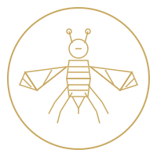
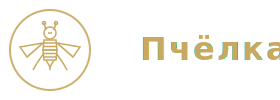
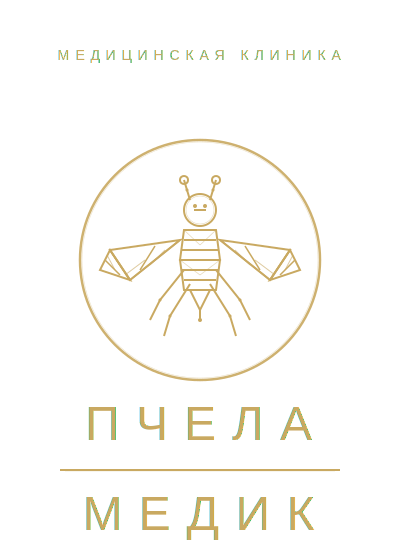

# Assets — Логотипы и иконки

## Файлы

### Логотипы
- **`logo-pro.svg`** ⭐ — Улучшенный полный логотип (400x560px) с детальной геометрией пчелы
- **`logo-mobile.svg`** 📱 — Мобильная версия (280x100px) горизонтальная компоновка
- `logo.svg` — Оригинальный полный логотип (400x560px) с текстом "ПЧЕЛА МЕДИК"
- `logo-compact.svg` — Компактная версия (200x200px) только пчела в круге
- `favicon.svg` — Упрощенная версия для favicon (32x32px)

### Улучшения в logo-pro.svg
✨ **На основе logo1.png с профессиональными улучшениями:**
- Более детальная геометрия пчелы (больше полигонов и граней)
- Объемные крылья с дополнительными вспомогательными линиями
- Улучшенное тело с внутренней структурой для глубины
- Детализированные ноги с суставами
- Глаза и усики с дополнительной детализацией
- Двойной контур круга для эффекта глубины
- Утолщенные линии (2px vs 1.5px) для лучшей видимости

### Использование

#### В HTML (header) - Адаптивная версия ⭐ Рекомендуется
```html
<!-- Адаптивный логотип с desktop и mobile версиями -->
<a href="#" class="logo" aria-label="Клиника Пчёлка Медик">
    <!-- Desktop: Компактная иконка + текст -->
    
    <span class="logo-text">Пчёлка</span>

    <!-- Mobile: Горизонтальный логотип с встроенным текстом -->
    
</a>
```

#### CSS для адаптивности
```css
/* Desktop - показываем иконку + текст */
.logo-desktop { display: inline-block; }
.logo-mobile { display: none; }
.logo-text { display: inline-block; }

/* Mobile (<768px) - показываем горизонтальный логотип */
@media (max-width: 768px) {
    .logo-desktop { display: none; }
    .logo-mobile { display: inline-block; }
    .logo-text { display: none; }
}
```

#### Старые варианты (для совместимости)
```html
<!-- Вариант 1: Профессиональный полный логотип -->


<!-- Вариант 2: Компактная иконка -->


<!-- Вариант 3: Мобильный горизонтальный -->

```

#### Favicon
```html
<!-- В <head> секции -->
<link rel="icon" type="image/svg+xml" href="/demo-mockups/assets/favicon.svg">
<link rel="icon" type="image/png" sizes="32x32" href="/demo-mockups/assets/favicon-32x32.png">
<link rel="icon" type="image/png" sizes="16x16" href="/demo-mockups/assets/favicon-16x16.png">
<link rel="apple-touch-icon" sizes="180x180" href="/demo-mockups/assets/apple-touch-icon.png">
```

## Генерация PNG/ICO из SVG

### Онлайн-инструменты (рекомендуется)
1. **Favicon Generator**: https://realfavicongenerator.net/
   - Загрузите `logo-compact.svg`
   - Автоматически создаст все нужные размеры
   - Скачайте пакет и распакуйте в `/demo-mockups/assets/`

2. **CloudConvert**: https://cloudconvert.com/svg-to-png
   - Конвертация SVG → PNG
   - Выберите нужный размер

### Командная строка (если установлен ImageMagick)
```bash
# Из корня проекта
cd demo-mockups/assets

# Создать PNG разных размеров
convert logo-compact.svg -resize 16x16 favicon-16x16.png
convert logo-compact.svg -resize 32x32 favicon-32x32.png
convert logo-compact.svg -resize 180x180 apple-touch-icon.png

# Создать ICO (Windows)
convert favicon-32x32.png favicon-16x16.png favicon.ico
```

### Node.js (если установлен sharp)
```bash
npm install sharp sharp-cli -g

# Создать PNG
sharp -i logo-compact.svg -o favicon-32x32.png resize 32 32
sharp -i logo-compact.svg -o favicon-16x16.png resize 16 16
sharp -i logo-compact.svg -o apple-touch-icon.png resize 180 180
```

## Необходимые размеры favicon

| Файл | Размер | Назначение |
|------|--------|------------|
| `favicon.svg` | Vector | Современные браузеры |
| `favicon.ico` | 16x16, 32x32 | IE, старые браузеры |
| `favicon-16x16.png` | 16x16 | Вкладки браузера |
| `favicon-32x32.png` | 32x32 | Закладки |
| `apple-touch-icon.png` | 180x180 | iOS Safari |
| `android-chrome-192x192.png` | 192x192 | Android Chrome |
| `android-chrome-512x512.png` | 512x512 | Android Chrome (HD) |

## Цвета

- **Золотой**: `#C9A961` (основной цвет логотипа)
- **Черный**: `#000000` (фон оригинального логотипа)
- **Прозрачный**: Для использования на любом фоне

## Преимущества SVG

✅ Масштабируется без потери качества
✅ Маленький размер файла
✅ Можно менять цвет через CSS
✅ Поддержка современными браузерами
✅ Retina-ready

## Примечания

- Оригинальный логотип: `logo1.png` и `logo4.png` (идентичны)
- SVG-версии созданы на основе геометрического дизайна из PNG
- Для production рекомендуется использовать SVG + PNG fallback
- Favicon.svg работает в Chrome 80+, Firefox 41+, Safari 9+

## Обновление вариантов

Все три варианта (classic, modern, premium) уже обновлены с реальным логотипом:
- ✅ variant-1-classic: logo1.png
- ✅ variant-2-modern: logo1.png
- ✅ variant-3-premium: logo1.png (header + footer)

Для использования SVG вместо PNG, замените:
```html
<!-- Было -->


<!-- Стало -->

```
