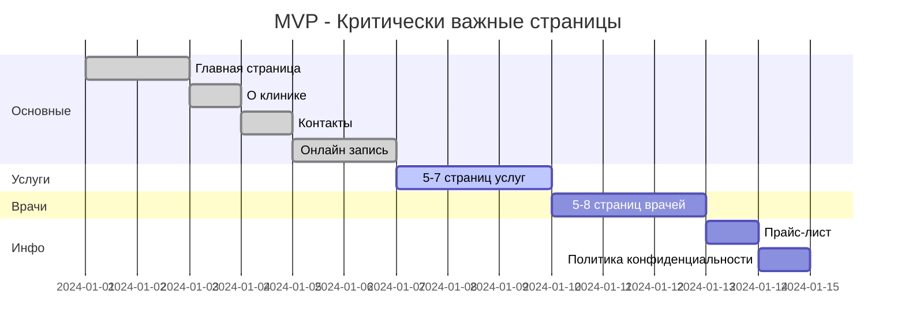
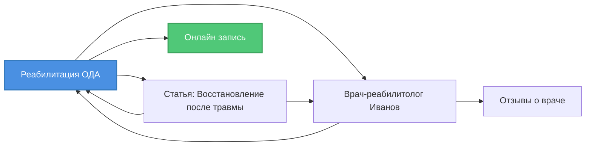

# СТРУКТУРА САЙТА И SITEMAP ДЛЯ SEO

## 🎯 Цели структуры сайта

### Для SEO
- Логическая иерархия страниц (максимум 3 клика от главной)
- Равномерное распределение ссылочного веса
- Покрытие всех целевых запросов
- Удобная индексация для поисковых роботов

### Для пользователей
- Интуитивная навигация
- Быстрый доступ к нужной информации
- Логические связи между страницами

---

## 📊 Рекомендуемая структура sitemap

### Визуализация структуры

```mermaid
graph TD
    A[Главная /] --> B[Услуги /services/]
    A --> C[Врачи /doctors/]
    A --> D[О клинике /about/]
    A --> E[Контакты /contacts/]
    A --> F[Запись /appointment/]
    
    B --> B1[Реабилитация /services/rehabilitation/]
    B --> B2[Физиотерапия /services/physiotherapy/]
    B --> B3[УЗИ /services/ultrasound/]
    B --> B4[Массаж /services/massage/]
    B --> B5[ЛФК /services/lfk/]
    
    C --> C1[Реабилитологи /doctors/rehabilitation/]
    C --> C2[Физиотерапевты /doctors/physiotherapy/]
    C --> C3[Врач 1 /doctors/ivanov/]
    C --> C4[Врач 2 /doctors/petrov/]
    
    A --> G[Блог /blog/]
    G --> G1[Реабилитация /blog/rehabilitation/]
    G --> G2[Здоровье /blog/health-tips/]
    
    A --> H[Информация]
    H --> H1[Прайс /prices/]
    H --> H2[Отзывы /reviews/]
    H --> H3[FAQ /faq/]
    
    style A fill:#C9A961,stroke:#B8935A,stroke-width:3px,color:#fff
    style B fill:#4A90E2,stroke:#357ABD,stroke-width:2px,color:#fff
    style C fill:#4A90E2,stroke:#357ABD,stroke-width:2px,color:#fff
    style F fill:#50C878,stroke:#3DA35D,stroke-width:2px,color:#fff
```



---

## 📋 Полная структура страниц

### 1. Основные страницы (Priority: 1.0)

| URL | Название | Ключевые запросы | Changefreq |
|-----|----------|------------------|------------|
| `/` | Главная | "клиника Мытищи", "медицинский центр Мытищи" | daily |
| `/about/` | О клинике | "клиника Пчёлка", "о клинике Мытищи" | weekly |
| `/contacts/` | Контакты | "адрес клиники Мытищи", "телефон клиники" | monthly |
| `/appointment/` | Онлайн запись | "запись к врачу Мытищи", "записаться онлайн" | daily |

### 2. Услуги (Priority: 0.9)

| URL | Название | Ключевые запросы | Changefreq |
|-----|----------|------------------|------------|
| `/services/` | Все услуги | "услуги клиники Мытищи" | weekly |
| `/services/rehabilitation/` | Реабилитация ОДА | "реабилитация Мытищи", "восстановление после травмы" | weekly |
| `/services/physiotherapy/` | Физиотерапия | "физиотерапия Мытищи", "физиолечение" | weekly |
| `/services/ultrasound/` | УЗИ диагностика | "УЗИ Мытищи", "ультразвуковая диагностика" | weekly |
| `/services/massage/` | Массаж | "массаж Мытищи", "лечебный массаж" | weekly |
| `/services/lfk/` | ЛФК | "ЛФК Мытищи", "лечебная физкультура" | weekly |
| `/services/consultations/` | Консультации | "консультация врача Мытищи" | weekly |

### 3. Врачи (Priority: 0.8)

| URL | Название | Ключевые запросы | Changefreq |
|-----|----------|------------------|------------|
| `/doctors/` | Все врачи | "врачи Мытищи", "специалисты клиники" | weekly |
| `/doctors/rehabilitation/` | Реабилитологи | "врач реабилитолог Мытищи" | monthly |
| `/doctors/physiotherapy/` | Физиотерапевты | "физиотерапевт Мытищи" | monthly |
| `/doctors/[slug]/` | Страница врача | "[ФИО врача] Мытищи" | monthly |

**Количество страниц врачей:** 15-20 (по одной на каждого специалиста)

### 4. Информационные страницы (Priority: 0.7)

| URL | Название | Ключевые запросы | Changefreq |
|-----|----------|------------------|------------|
| `/prices/` | Прайс-лист | "цены клиника Мытищи", "стоимость услуг" | weekly |
| `/reviews/` | Отзывы | "отзывы клиника Мытищи" | daily |
| `/faq/` | Вопросы-ответы | "часто задаваемые вопросы клиника" | monthly |
| `/insurance/` | Страхование | "ДМС Мытищи", "страховка клиника" | monthly |
| `/licenses/` | Лицензии | "лицензия клиники", "сертификаты" | yearly |

### 5. Блог и статьи (Priority: 0.6)

| URL | Название | Ключевые запросы | Changefreq |
|-----|----------|------------------|------------|
| `/blog/` | Блог | "статьи о здоровье" | weekly |
| `/blog/rehabilitation/` | Реабилитация | "как восстановиться после травмы" | weekly |
| `/blog/physiotherapy/` | Физиотерапия | "методы физиотерапии" | weekly |
| `/blog/health-tips/` | Советы | "советы по здоровью" | weekly |
| `/blog/[article-slug]/` | Статья | Длинные хвосты | monthly |

**Количество статей:** 50-100 (постепенное наполнение)

### 6. Локальные страницы (Priority: 0.8)

| URL | Название | Ключевые запросы | Changefreq |
|-----|----------|------------------|------------|
| `/mytishchi/` | Клиника в Мытищах | "клиника Мытищи центр" | monthly |
| `/mytishchi/how-to-get/` | Как добраться | "как добраться до клиники Мытищи" | monthly |
| `/mytishchi/parking/` | Парковка | "парковка клиника Мытищи" | monthly |

### 7. Служебные страницы (Priority: 0.3)

| URL | Название | Changefreq |
|-----|----------|------------|
| `/privacy-policy/` | Политика конфиденциальности | yearly |
| `/terms-of-service/` | Пользовательское соглашение | yearly |
| `/sitemap/` | HTML Sitemap | monthly |

---

## 📈 Приоритизация по фазам

### MVP (Фаза 1) - 15-20 страниц

**Срок:** 1-2 недели разработки



**Список страниц MVP:**
1. ✅ Главная
2. ✅ О клинике
3. ✅ Контакты + карта
4. ✅ Онлайн запись
5. ✅ Реабилитация ОДА
6. ✅ Физиотерапия
7. ✅ УЗИ диагностика
8. ✅ Массаж
9. ✅ ЛФК
10. ✅ Консультации
11. ✅ Каталог услуг
12. ✅ 5-8 врачей (отдельные страницы)
13. ✅ Каталог врачей
14. ✅ Прайс-лист
15. ✅ Политика конфиденциальности

**Итого:** 15-20 страниц

### Фаза 2 - +30 страниц

**Срок:** 1-2 месяца после запуска

**Добавляем:**
- Отзывы пациентов (с модерацией)
- FAQ (10-15 вопросов)
- Лицензии и сертификаты
- Работа со страховыми
- Как добраться
- 10-15 статей в блог (локальные запросы)
- Расширение команды врачей (еще 5-10 страниц)

**Итого:** 45-50 страниц

### Фаза 3 - +50-80 страниц

**Срок:** 3-6 месяцев после запуска

**Добавляем:**
- Расширенный блог (50+ статей)
- Детальные страницы по подуслугам
- Кейсы лечения
- Видео-контент
- Локальные лендинги

**Итого:** 100-150 страниц

---

## 🔗 Стратегия внутренней перелинковки

### Принципы

1. **Главная страница** → ссылки на все основные разделы
2. **Услуги** → ссылки на врачей, которые оказывают эту услугу
3. **Врачи** → ссылки на услуги, которые они предоставляют
4. **Блог** → ссылки на релевантные услуги и врачей
5. **Все страницы** → ссылка на онлайн запись

### Пример перелинковки



### Рекомендации по анкорам

**Хорошие анкоры:**
- "Записаться на реабилитацию"
- "Узнать больше о физиотерапии"
- "Посмотреть всех врачей-реабилитологов"
- "Читать отзывы пациентов"

**Плохие анкоры:**
- "Нажмите здесь"
- "Подробнее"
- "Ссылка"
- "Читать далее"

---

## 🗂️ XML Sitemap

### Структура файла

```xml
<?xml version="1.0" encoding="UTF-8"?>
<urlset xmlns="http://www.sitemaps.org/schemas/sitemap/0.9">
  
  <!-- Главная страница -->
  <url>
    <loc>https://pchelka-clinic.ru/</loc>
    <lastmod>2024-01-15</lastmod>
    <changefreq>daily</changefreq>
    <priority>1.0</priority>
  </url>
  
  <!-- Услуги -->
  <url>
    <loc>https://pchelka-clinic.ru/services/rehabilitation/</loc>
    <lastmod>2024-01-15</lastmod>
    <changefreq>weekly</changefreq>
    <priority>0.9</priority>
  </url>
  
  <!-- Врачи -->
  <url>
    <loc>https://pchelka-clinic.ru/doctors/ivanov/</loc>
    <lastmod>2024-01-10</lastmod>
    <changefreq>monthly</changefreq>
    <priority>0.8</priority>
  </url>
  
  <!-- Блог -->
  <url>
    <loc>https://pchelka-clinic.ru/blog/rehabilitation-after-injury/</loc>
    <lastmod>2024-01-12</lastmod>
    <changefreq>monthly</changefreq>
    <priority>0.6</priority>
  </url>
  
</urlset>
```

### Автоматическая генерация

**Django пример:**

```python
# sitemaps.py
from django.contrib.sitemaps import Sitemap
from .models import Service, Doctor, BlogPost

class ServiceSitemap(Sitemap):
    changefreq = "weekly"
    priority = 0.9

    def items(self):
        return Service.objects.filter(is_active=True)

    def lastmod(self, obj):
        return obj.updated_at

class DoctorSitemap(Sitemap):
    changefreq = "monthly"
    priority = 0.8

    def items(self):
        return Doctor.objects.filter(is_active=True)

class BlogSitemap(Sitemap):
    changefreq = "monthly"
    priority = 0.6

    def items(self):
        return BlogPost.objects.filter(is_published=True)

    def lastmod(self, obj):
        return obj.published_at

# urls.py
from django.contrib.sitemaps.views import sitemap

sitemaps = {
    'services': ServiceSitemap,
    'doctors': DoctorSitemap,
    'blog': BlogSitemap,
}

urlpatterns = [
    path('sitemap.xml', sitemap, {'sitemaps': sitemaps}),
]
```

---

## 📱 HTML Sitemap для пользователей

### Пример структуры

```html
<div class="sitemap-page">
  <h1>Карта сайта</h1>
  
  <section class="sitemap-section">
    <h2>Услуги</h2>
    <ul>
      <li><a href="/services/rehabilitation/">Реабилитация ОДА</a></li>
      <li><a href="/services/physiotherapy/">Физиотерапия</a></li>
      <li><a href="/services/ultrasound/">УЗИ диагностика</a></li>
      <li><a href="/services/massage/">Массаж</a></li>
      <li><a href="/services/lfk/">ЛФК</a></li>
    </ul>
  </section>
  
  <section class="sitemap-section">
    <h2>Врачи</h2>
    <ul>
      <li><a href="/doctors/ivanov/">Иванов И.И. - Реабилитолог</a></li>
      <li><a href="/doctors/petrov/">Петров П.П. - Физиотерапевт</a></li>
      <!-- ... -->
    </ul>
  </section>
  
  <section class="sitemap-section">
    <h2>Информация</h2>
    <ul>
      <li><a href="/about/">О клинике</a></li>
      <li><a href="/prices/">Прайс-лист</a></li>
      <li><a href="/reviews/">Отзывы</a></li>
      <li><a href="/faq/">Вопросы и ответы</a></li>
    </ul>
  </section>
</div>
```

---

## ✅ Чек-лист проверки структуры

### Техническая проверка

- [ ] XML sitemap сгенерирован и доступен по `/sitemap.xml`
- [ ] Sitemap отправлен в Google Search Console
- [ ] Sitemap отправлен в Яндекс.Вебмастер
- [ ] Все URL в sitemap возвращают 200 OK
- [ ] Нет дублирующихся URL
- [ ] Все страницы доступны за 3 клика от главной
- [ ] HTML sitemap создан для пользователей

### SEO проверка

- [ ] Каждая страница имеет уникальный title
- [ ] Каждая страница имеет уникальный description
- [ ] Каждая страница имеет H1 заголовок
- [ ] Внутренние ссылки используют описательные анкоры
- [ ] Breadcrumbs (хлебные крошки) на всех страницах
- [ ] Canonical URL указан на всех страницах
- [ ] Schema.org разметка добавлена

### Контентная проверка

- [ ] Каждая страница содержит минимум 300 слов
- [ ] Ключевые слова естественно интегрированы
- [ ] Есть призывы к действию (CTA)
- [ ] Изображения имеют alt-теги
- [ ] Контент уникальный (не скопирован)

---

## 📊 Метрики для отслеживания

### Индексация

```
Цель: 90%+ страниц проиндексированы за 2 недели

Отслеживание:
- Google Search Console > Покрытие
- Яндекс.Вебмастер > Индексирование
```

### Органический трафик

```
Цель: +30% за 6 месяцев

Отслеживание:
- Google Analytics 4 > Acquisition > Traffic acquisition
- Яндекс.Метрика > Источники > Поисковые системы
```

### Позиции в поиске

```
Цель: ТОП-10 по 20+ ключевым запросам за 3 месяца

Отслеживание:
- Google Search Console > Эффективность
- SE Ranking / Serpstat
```

---

## 🔄 Обновление sitemap

### Частота обновлений

- **Ежедневно:** Главная, блог, отзывы
- **Еженедельно:** Услуги, прайс
- **Ежемесячно:** Врачи, информационные страницы
- **Ежегодно:** Служебные страницы

### Автоматизация

```python
# Django management command
from django.core.management.base import BaseCommand
from django.contrib.sitemaps import ping_google

class Command(BaseCommand):
    help = 'Ping Google about sitemap update'

    def handle(self, *args, **options):
        try:
            ping_google()
            self.stdout.write(
                self.style.SUCCESS('Successfully pinged Google')
            )
        except Exception as e:
            self.stdout.write(
                self.style.ERROR(f'Ping failed: {e}')
            )
```

---

## 📚 Связанные документы

- [SEO и маркетинг - Обзор]({{ '/deployment/seo-marketing/' | relative_url }})
- [Техническое SEO]({{ '/deployment/seo-marketing/' | relative_url }}#техническое-seo)
- [Локальное SEO]({{ '/deployment/seo-marketing/' | relative_url }}#локальное-seo)
- [Контентная стратегия]({{ '/deployment/seo-marketing/' | relative_url }}#контентная-стратегия)

---

**Последнее обновление:** {{ 'now' | date: "%d.%m.%Y" }}
