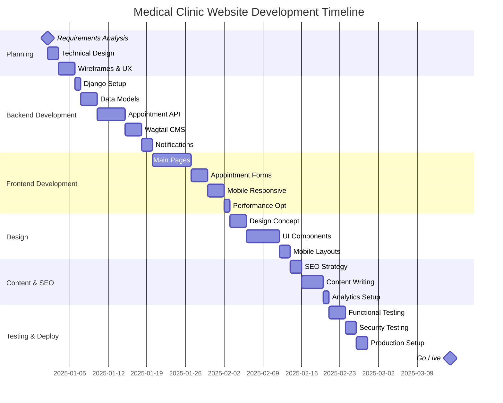
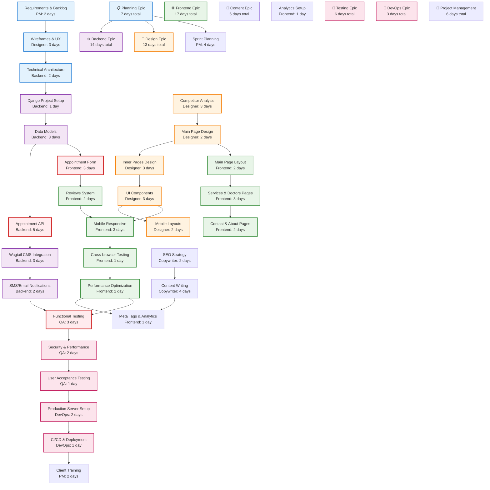
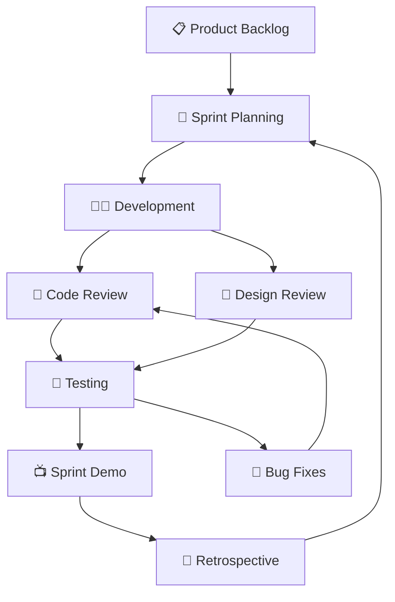

# 👩‍💻 Development Workflow & WBS

> **Interactive Workflow**: Click on epic nodes to view detailed task breakdowns

## 🏗️ Epic Breakdown with Dependencies

## ⚡ Critical Path Analysis

```mermaid
graph LR
    %% Critical path highlighting
    classDef critical fill:#ffcdd2,stroke:#d32f2f,stroke-width:3px
    classDef normal fill:#f5f5f5,stroke:#757575,stroke-width:1px

    A[Start] --> B[Requirements<br/>2 days]
    B --> C[Wireframes<br/>3 days]
    C --> D[Django Setup<br/>1 day]
    D --> E[Data Models<br/>3 days]
    E --> F[API Development<br/>5 days]
    F --> G[Frontend Forms<br/>3 days]
    G --> H[Integration Testing<br/>3 days]
    H --> I[Deployment<br/>2 days]
    I --> J[Go Live]

    class B,C,E,F,G,H critical
    class D,I normal
```

## 👥 Team Coordination Matrix

| Week | PM | Designer | Backend | Frontend | Copywriter | QA | DevOps |
|------|----|---------|---------|---------|-----------|----|--------|
| **Week 1** | Requirements | Wireframes | Architecture | - | - | - | - |
| **Week 2** | Planning | Concept Design | Django Setup | - | SEO Strategy | - | - |
| **Week 3** | Coordination | UI Design | Data Models | Main Pages | Content Writing | - | - |
| **Week 4** | Reviews | Components | API Development | Forms | Content | - | Server Setup |
| **Week 5** | Testing Coord | Mobile Design | CMS Integration | Responsive | Meta Tags | Functional Tests | - |
| **Week 6** | UAT Support | Polish | Notifications | Optimization | Analytics | Security Tests | Deployment |
| **Week 7** | Training | Documentation | Bug Fixes | Bug Fixes | Final Content | UAT | Go Live |

## 🔄 Agile Workflow Process

## 📊 Resource Allocation by Epic

| Epic | PM | Designer | Backend | Frontend | Copywriter | QA | DevOps | **Total** |
|------|----|---------|---------|---------|-----------|----|--------|-----------|
| Planning | 2 | 3 | 2 | 0 | 0 | 0 | 0 | **7** |
| Backend | 0 | 0 | 14 | 0 | 0 | 0 | 0 | **14** |
| Frontend | 0 | 0 | 0 | 17 | 0 | 0 | 0 | **17** |
| Design | 0 | 13 | 0 | 0 | 0 | 0 | 0 | **13** |
| Content/SEO | 0 | 0 | 0 | 2 | 6 | 0 | 0 | **8** |
| Testing | 0 | 0 | 0 | 0 | 0 | 6 | 0 | **6** |
| DevOps | 0 | 0 | 0 | 0 | 0 | 0 | 3 | **3** |
| PM Overhead | 6 | 0 | 0 | 0 | 0 | 0 | 0 | **6** |
| **TOTAL** | **8** | **16** | **16** | **19** | **6** | **6** | **3** | **74** |

## 🎯 Sprint Goals & Milestones

### Sprint 1 (Week 1-2): Foundation
- ✅ Requirements finalized
- ✅ Technical architecture approved
- ✅ Design wireframes completed
- ✅ Django project initialized

### Sprint 2 (Week 3-4): Core Development
- ✅ Data models implemented
- ✅ Basic API endpoints
- ✅ Main page design & frontend
- ✅ CMS integration started

### Sprint 3 (Week 5-6): Integration
- ✅ Appointment booking system
- ✅ Frontend-backend integration
- ✅ Mobile responsiveness
- ✅ Content integration

### Sprint 4 (Week 7-8): Testing & Launch
- ✅ Full system testing
- ✅ Performance optimization
- ✅ Production deployment
- ✅ Go-live & monitoring

## 🔗 Related Documentation

- [📋 Detailed Task Estimates](./development/tasks_estimates.md)
- [📝 Requirements Templates](./development/brd_prd_frd_templates.md)
- [🧪 Testing Acceptance Criteria](./deployment/testing_acceptance.md)
- [🏗️ Technical Architecture](./technical/technical_architecture.md)
- [🎨 UX Design Requirements](./design/ux_design_requirements.md)

---

> **Workflow Navigation**: Use the interactive diagrams above to explore specific epic details and team coordination. Click on nodes to access detailed documentation for each development phase.