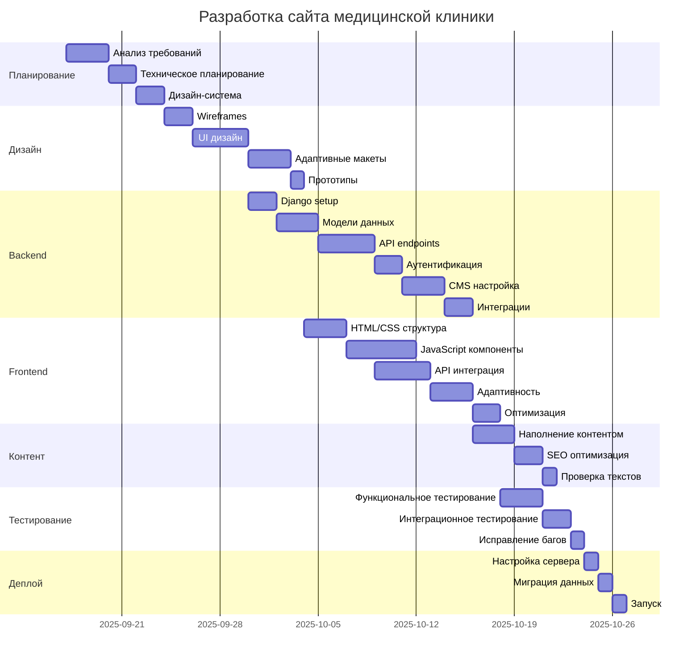
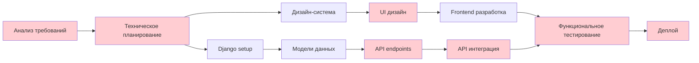

# 👩‍💻 Процесс разработки проекта

## 📋 Обзор этапов (Standard сценарий - 65 дней)

### 1️⃣ Планирование - 7 дней
Анализ требований, техническое планирование, создание дизайн-системы

### 2️⃣ Дизайн - 10 дней
UI/UX дизайн, прототипы, адаптивные макеты

### 3️⃣ Backend - 16 дней
Django setup, API, база данных, интеграции

### 4️⃣ Frontend - 17 дней
HTML/CSS/JS, компоненты, интеграция с API

### 5️⃣ Контент - 6 дней
Наполнение контентом, SEO оптимизация

### 6️⃣ Тестирование - 6 дней
QA тестирование, исправление багов

### 7️⃣ Деплой - 3 дня
Настройка продакшена, запуск

## 📊 Диаграмма Ганта

## 👥 Матрица ответственности команды

| Этап / Роль | PM | Designer | Backend | Frontend | QA | DevOps | Copywriter |
|-------------|----|---------|---------|---------|----|--------|------------|
| **Планирование** | Ведущий | Участник | Участник | Участник | Консультант | Участник | Консультант |
| **Дизайн** | Участник | Ведущий | Консультант | Участник | Консультант | - | Участник |
| **Backend** | Участник | Консультант | Ведущий | Участник | Участник | Участник | - |
| **Frontend** | Участник | Участник | Участник | Ведущий | Участник | Консультант | Участник |
| **Контент** | Участник | Участник | Консультант | Участник | Консультант | - | Ведущий |
| **Тестирование** | Участник | Консультант | Участник | Участник | Ведущий | Консультант | Консультант |
| **Деплой** | Участник | - | Участник | Консультант | Участник | Ведущий | - |

## 🚨 Критический путь и зависимости

> ⚠️ **Критично:** Задержка любого элемента критического пути отодвигает весь проект!

## ⚠️ Основные проектные риски

### 🔴 Высокий риск
- **Неопределенность требований** - Детальное интервью с клиентом, прототипирование
- **Сложность интеграций** - Ранняя проверка API, создание mock-сервисов

### 🟡 Средний риск
- **Производительность системы** - Нагрузочное тестирование, оптимизация
- **Недоступность команды** - Кросс-тренинг, документирование

### 🟢 Низкий риск
- **Изменения в дизайне** - Утверждение прототипов, контрольные точки
- **Браузерная совместимость** - Progressive enhancement, тестирование

## 🎯 Ключевые вехи

### 📋 День 7: Завершение планирования
Утверждение ТЗ и дизайн-системы

### 🎨 День 17: Готовность дизайна
Все макеты и прототипы готовы

### ⚙️ День 33: MVP Backend
Основной API и интеграции

### 🌐 День 50: Альфа-версия
Полнофункциональная система на staging

### 🧪 День 56: Готовность к тестированию
Контент загружен, багфиксы завершены

### 🚀 День 65: Продакшен релиз
Система запущена и доступна пользователям

## 📈 Сравнение сценариев

| Характеристика | MVP (45 дней) | Standard (65 дней) | Premium (90 дней) |
|----------------|---------------|-------------------|-------------------|
| **Планирование** | 5 дней | 7 дней | 10 дней |
| **Дизайн** | 8 дней | 10 дней | 15 дней |
| **Backend** | 10 дней | 16 дней | 25 дней |
| **Frontend** | 12 дней | 17 дней | 22 дня |
| **Функциональность** | Базовая запись, каталог врачей | + Отзывы, интеграции, аналитика | + Платежи, личный кабинет, CRM |
| **Риски** | Высокие (урезанная функциональность) | Низкие (сбалансированный подход) | Средние (сложность интеграций) |