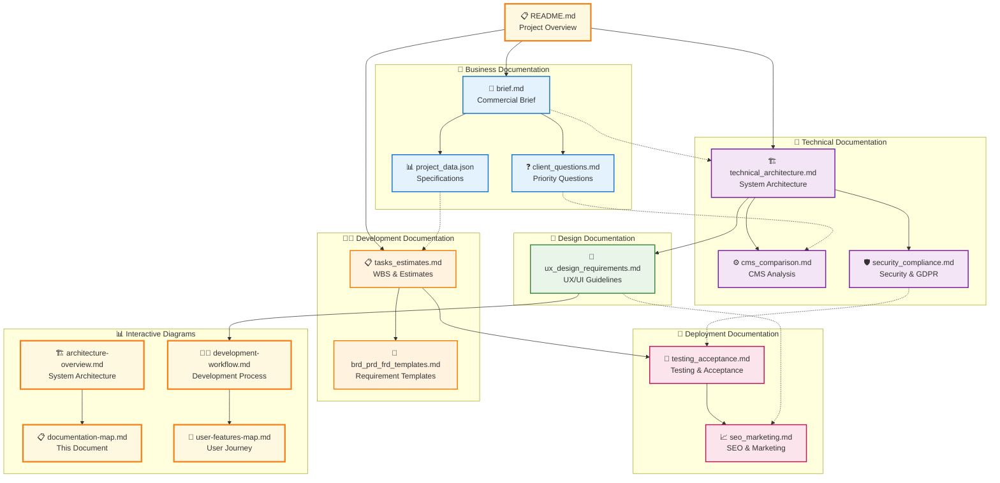
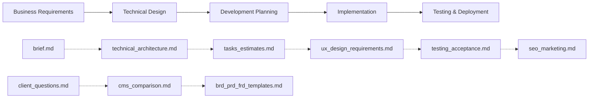

# 📋 Documentation Structure & Navigation Map

> **Interactive Documentation Map**: Click on any document to navigate directly to it

## 📚 Documentation Organization by Team Role

### 👔 Project Managers & Stakeholders
**Start Here**: Essential business documents for project planning
- [📄 brief.md](./business/brief.md) - Complete commercial project brief
- [📊 project_data.json](./business/project_data.json) - Machine-readable specifications
- [📋 tasks_estimates.md](./development/tasks_estimates.md) - Work breakdown & estimates

### 👨‍💻 Backend Developers & System Architects
**Technical Foundation**: Architecture and implementation guides
- [🏗️ technical_architecture.md](./technical/technical_architecture.md) - Complete system architecture
- [⚙️ cms_comparison.md](./technical/cms_comparison.md) - CMS technology analysis
- [🛡️ security_compliance.md](./technical/security_compliance.md) - Security requirements

### 🎨 UI/UX Designers & Frontend Developers
**Design System**: User experience and interface guidelines
- [🎯 ux_design_requirements.md](./design/ux_design_requirements.md) - Complete UX/UI specifications
- [📈 seo_marketing.md](./deployment/seo_marketing.md) - Content and marketing strategy
- [👤 user-features-map.md](./user-features-map.md) - User journey visualization

### 🧪 QA Engineers & DevOps
**Quality Assurance**: Testing and deployment procedures
- [🧪 testing_acceptance.md](./deployment/testing_acceptance.md) - Testing criteria & acceptance
- [🛡️ security_compliance.md](./technical/security_compliance.md) - Security testing requirements
- [🏗️ architecture-overview.md](./architecture-overview.md) - Infrastructure overview

## 🔄 Document Workflow & Dependencies

## 🎯 Quick Access by Project Phase

| Phase | Primary Documents | Supporting Docs |
|-------|------------------|-----------------|
| **Planning** | brief.md, client_questions.md | project_data.json |
| **Architecture** | technical_architecture.md | cms_comparison.md, security_compliance.md |
| **Design** | ux_design_requirements.md | brief.md |
| **Development** | tasks_estimates.md | brd_prd_frd_templates.md |
| **Testing** | testing_acceptance.md | security_compliance.md |
| **Launch** | seo_marketing.md | testing_acceptance.md |

## 🔍 Document Search Index

### By Content Type
- **📊 Data Models**: technical_architecture.md
- **💰 Budget & Timeline**: tasks_estimates.md, brief.md
- **🎨 Design System**: ux_design_requirements.md
- **🔒 Security Requirements**: security_compliance.md
- **📈 Marketing Strategy**: seo_marketing.md
- **❓ Open Questions**: client_questions.md

### By Priority Level
- **🔴 Critical**: brief.md, technical_architecture.md, tasks_estimates.md
- **🟡 Important**: ux_design_requirements.md, security_compliance.md
- **🟢 Supporting**: cms_comparison.md, testing_acceptance.md, seo_marketing.md

## 🧭 Navigation Tips

1. **Start with README.md** for project overview
2. **Use diagrams** for visual navigation between related docs
3. **Follow cross-references** (links and arrows) for related content
4. **Check dependencies** before diving deep into technical docs
5. **Use role-based sections** to find relevant documentation quickly

---

> **Interactive Features**: Click on any document name in the diagram above to navigate directly to it. Use the role-based sections to find documentation relevant to your responsibilities.