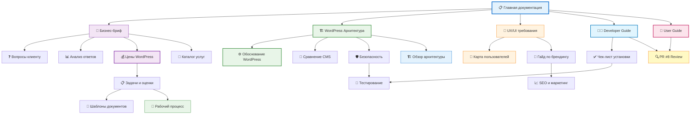

# 📋 Карта документации проекта

**Статус проекта:** ✅ WordPress MVP (8 дней)  
**Последнее обновление:** 6 октября 2025

## 📊 Статистика документации

| Категория | Документов | Статус |
|-----------|------------|--------|
| 💼 Бизнес | 9 | ✅ Актуально |
| 🔧 Техническая | 5 | ✅ Актуально (WordPress) |
| 🎨 Дизайн | 3 | ✅ Актуально |
| 👩‍💻 Разработка | 2 | ✅ Актуально |
| 🚀 Деплой | 4 | ✅ Актуально |
| 📚 Руководства | 4 | ✅ Новое |
| 🔍 Ревью | 1 | ✅ Новое |
| 🌐 Интерактивные | 5 | ✅ Актуально |
| **Всего** | **33** | **100% актуально** |

⭐ - Ключевые документы для WordPress проекта

---

## 🚀 Быстрый старт

### Для разработчика (начать работу):
1. 📋 [Главная документация]({{ '/readme' | relative_url }}) - обзор проекта
2. 👩‍💻 [Developer Guide]({{ '/developer-guide/' | relative_url }}) - пошаговая установка
3. 🏗️ [WordPress Архитектура]({{ '/technical/wordpress-architecture/' | relative_url }}) - технические детали
4. ✅ [Чек-лист установки]({{ '/deployment/wordpress_setup_checklist.html' | relative_url }}) - проверка перед запуском

### Для администратора клиники:
1. 👤 [User Guide (RU)]({{ '/ru/user-guide/' | relative_url }}) - управление контентом
2. 🏥 [Каталог услуг]({{ '/business/services_catalog.html' | relative_url }}) - список услуг для добавления

### Для менеджера проекта:
1. 💰 [Цены WordPress]({{ '/business/wordpress-pricing-simple/' | relative_url }}) - коммерческое предложение
2. 📋 [Задачи и оценки]({{ '/development/tasks_estimates.html' | relative_url }}) - планирование
3. 🔄 [Рабочий процесс]({{ '/development-workflow' | relative_url }}) - workflow

---

## 🔍 Быстрый доступ к документам

### 💼 Бизнес-документация
**Коммерческие требования, бриф и вопросы клиенту**

- 📄 [Коммерческий бриф]({{ '/business/brief/' | relative_url }}) - Core
- 📊 [Данные проекта (JSON)]({{ '/business/project_data.json' | relative_url }}) - API
- ❓ [Вопросы клиенту]({{ '/business/client_questions.html' | relative_url }}) - Priority
- 📋 [Анализ ответов клиента]({{ '/business/client_analysis.html' | relative_url }}) - Analysis
- 🏥 [Каталог услуг]({{ '/business/services_catalog.html' | relative_url }}) - Content
- 💰 [Цены WordPress (кратко)]({{ '/business/wordpress-pricing-simple/' | relative_url }}) - Pricing ⭐
- 📊 [Расчет стоимости WordPress]({{ '/business/wordpress_pricing_calculation.html' | relative_url }}) - Detailed
- 🔍 [Анализ бюджетного пакета]({{ '/business/wordpress-budget-analysis/' | relative_url }}) - Analysis ⭐
- 📝 [Смета WordPress MVP]({{ '/business/wordpress_lite_mvp_estimate.html' | relative_url }}) - Estimate

### 🔧 Техническая архитектура
**Техническое решение, стек и безопасность**

- 🏗️ [Архитектура WordPress]({{ '/technical/wordpress-architecture/' | relative_url }}) - Core ⭐
- ⚙️ [Обоснование выбора WordPress]({{ '/technical/wordpress-solution/' | relative_url }}) - Decision ⭐
- 🏛️ [Архитектура Django]({{ '/technical/technical-architecture/' | relative_url }}) - Reference
- 📝 [Сравнение CMS]({{ '/technical/cms_comparison.html' | relative_url }}) - Analysis
- 🛡️ [Безопасность и соответствие]({{ '/technical/security_compliance.html' | relative_url }}) - Security

### 🎨 Дизайн и UX
**Пользовательский опыт и дизайн-требования**

- 🎨 [UX/UI требования]({{ '/design/ux-design-requirements/' | relative_url }}) - Design
- 🎨 [Гайд по брендингу]({{ '/design/branding_guidelines.html' | relative_url }}) - Branding ⭐
- 👤 [Карта пользователей]({{ '/user-features-map' | relative_url }}) - Interactive

### 👩‍💻 Разработка
**Планирование задач и шаблоны документов**

- 📋 [Задачи и оценки]({{ '/development/tasks_estimates.html' | relative_url }}) - Planning
- 📑 [Шаблоны документов]({{ '/development/brd-prd-frd-templates/' | relative_url }}) - Templates
- 🔄 [Рабочий процесс]({{ '/development-workflow' | relative_url }}) - Interactive

### 🚀 Деплой и маркетинг
**Тестирование, развертывание и продвижение**

- ✅ [Чек-лист установки WordPress]({{ '/deployment/wordpress_setup_checklist.html' | relative_url }}) - Setup ⭐
- 🧪 [Тестирование и приемка]({{ '/deployment/testing-acceptance/' | relative_url }}) - QA
- 📈 [SEO и маркетинг]({{ '/deployment/seo-marketing/' | relative_url }}) - Marketing
- 🗺️ [SEO Sitemap]({{ '/deployment/seo_sitemap.html' | relative_url }}) - SEO

### 📚 Руководства
**Пошаговые инструкции для разработчиков и пользователей**

- 👩‍💻 [Developer Guide (EN)]({{ '/developer-guide/' | relative_url }}) - Setup ⭐
- 👩‍💻 [Руководство разработчика (RU)]({{ '/ru/developer-guide/' | relative_url }}) - Setup ⭐
- 👤 [User Guide (EN)]({{ '/user-guide/' | relative_url }}) - Admin ⭐
- 👤 [Руководство пользователя (RU)]({{ '/ru/user-guide/' | relative_url }}) - Admin ⭐

### 🔍 Ревью и анализ
**Code review и технический анализ**

- 📝 [PR #8 Code Review]({{ '/reviews/pr-8/' | relative_url }}) - Review

### 🌐 Интерактивные страницы
**Специальные визуализации и диаграммы**

- 🏗️ [Обзор архитектуры]({{ '/architecture-overview' | relative_url }}) - Visual ⭐
- 📖 [Главная документация]({{ '/readme' | relative_url }}) - Overview
- 📋 [Карта документации]({{ '/documentation-map/' | relative_url }}) - Navigation
- 🔄 [Рабочий процесс]({{ '/development-workflow' | relative_url }}) - Workflow
- 📚 [Глоссарий]({{ '/glossary.html' | relative_url }}) - Terms

## 🗺️ Диаграмма зависимостей документов

## 👥 Доступ по ролям команды

### 🏢 Project Manager
**Ключевые документы:**
- 📋 [Главная документация]({{ '/readme' | relative_url }})
- 💼 [Бизнес-бриф]({{ '/business/brief/' | relative_url }})
- 💰 [Цены WordPress]({{ '/business/wordpress-pricing-simple/' | relative_url }})
- 📋 [Задачи и оценки]({{ '/development/tasks_estimates.html' | relative_url }})
- 🔄 [Рабочий процесс]({{ '/development-workflow' | relative_url }})

### 🎨 UI/UX Designer
**Ключевые документы:**
- 🎨 [UX/UI требования]({{ '/design/ux-design-requirements/' | relative_url }})
- 🎨 [Гайд по брендингу]({{ '/design/branding_guidelines.html' | relative_url }})
- 👤 [Карта пользователей]({{ '/user-features-map' | relative_url }})
- 🏥 [Каталог услуг]({{ '/business/services_catalog.html' | relative_url }})

### 👩‍💻 WordPress Developer
**Ключевые документы:**
- 👩‍💻 [Developer Guide]({{ '/developer-guide/' | relative_url }}) ⭐
- 🏗️ [WordPress Архитектура]({{ '/technical/wordpress-architecture/' | relative_url }}) ⭐
- ⚙️ [Обоснование WordPress]({{ '/technical/wordpress-solution/' | relative_url }})
- ✅ [Чек-лист установки]({{ '/deployment/wordpress_setup_checklist.html' | relative_url }})
- 🛡️ [Безопасность]({{ '/technical/security_compliance.html' | relative_url }})

### ⚙️ Backend Developer (Django - reference)
**Ключевые документы:**
- 🏛️ [Архитектура Django]({{ '/technical/technical-architecture/' | relative_url }})
- 📝 [Сравнение CMS]({{ '/technical/cms_comparison.html' | relative_url }})
- 🛡️ [Безопасность]({{ '/technical/security_compliance.html' | relative_url }})

### 🌐 Frontend Developer
**Ключевые документы:**
- 🎨 [UX/UI требования]({{ '/design/ux-design-requirements/' | relative_url }})
- 🏗️ [WordPress Архитектура]({{ '/technical/wordpress-architecture/' | relative_url }})
- 👩‍💻 [Developer Guide]({{ '/developer-guide/' | relative_url }})

### 🧪 QA Engineer
**Ключевые документы:**
- 🧪 [Тестирование]({{ '/deployment/testing-acceptance/' | relative_url }})
- ✅ [Чек-лист установки]({{ '/deployment/wordpress_setup_checklist.html' | relative_url }})
- 🔍 [PR #8 Review]({{ '/reviews/pr-8/' | relative_url }})

### 🚀 DevOps Engineer
**Ключевые документы:**
- 🏗️ [WordPress Архитектура]({{ '/technical/wordpress-architecture/' | relative_url }})
- ✅ [Чек-лист установки]({{ '/deployment/wordpress_setup_checklist.html' | relative_url }})
- 🛡️ [Безопасность]({{ '/technical/security_compliance.html' | relative_url }})
- 👩‍💻 [Developer Guide]({{ '/developer-guide/' | relative_url }})

### 📈 Marketing Specialist
**Ключевые документы:**
- 📈 [SEO и маркетинг]({{ '/deployment/seo-marketing/' | relative_url }})
- 🗺️ [SEO Sitemap]({{ '/deployment/seo_sitemap.html' | relative_url }})
- 🏥 [Каталог услуг]({{ '/business/services_catalog.html' | relative_url }})

### 👤 Clinic Administrator
**Ключевые документы:**
- 👤 [User Guide]({{ '/user-guide/' | relative_url }}) ⭐
- 👤 [Руководство пользователя (RU)]({{ '/ru/user-guide/' | relative_url }}) ⭐
- 🏥 [Каталог услуг]({{ '/business/services_catalog.html' | relative_url }})