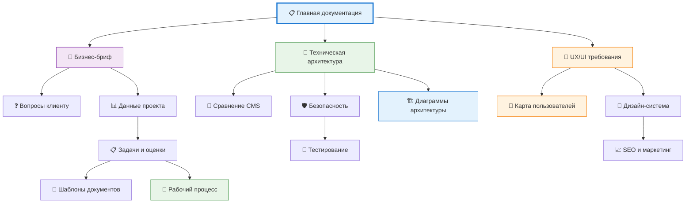

# 📋 Карта документации проекта

## 🔍 Быстрый доступ к документам

### 💼 Бизнес-документация
**Коммерческие требования, бриф и вопросы клиенту**

- 📄 [Коммерческий бриф]({{ '/business/brief/' | relative_url }}) - Core
- 📊 [Данные проекта (JSON)]({{ '/business/project_data.json' | relative_url }}) - API
- ❓ [Вопросы клиенту]({{ '/business/client_questions.html' | relative_url }}) - Priority

### 🔧 Техническая архитектура
**Техническое решение, стек и безопасность**

- 🏗️ [Техническая архитектура]({{ '/technical/technical-architecture/' | relative_url }}) - Core
- 📝 [Сравнение CMS]({{ '/technical/cms_comparison.html' | relative_url }}) - Analysis
- 🛡️ [Безопасность]({{ '/technical/security_compliance.html' | relative_url }}) - Security

### 🎨 Дизайн и UX
**Пользовательский опыт и дизайн-требования**

- 🎨 [UX/UI требования]({{ '/design/ux-design-requirements/' | relative_url }}) - Design
- 👤 [Карта пользователей]({{ '/user-features-map' | relative_url }}) - Interactive

### 👩‍💻 Разработка
**Планирование задач и шаблоны документов**

- 📋 [Задачи и оценки]({{ '/development/tasks_estimates.html' | relative_url }}) - Planning
- 📑 [Шаблоны документов]({{ '/development/brd_prd_frd_templates.html' | relative_url }}) - Templates
- 🔄 [Рабочий процесс]({{ '/development-workflow' | relative_url }}) - Interactive

### 🚀 Деплой и маркетинг
**Тестирование, развертывание и продвижение**

- 🧪 [Тестирование]({{ '/deployment/testing_acceptance.html' | relative_url }}) - QA
- 📈 [SEO и маркетинг]({{ '/deployment/seo_marketing.html' | relative_url }}) - Marketing

### 🌐 Интерактивные страницы
**Специальные визуализации и диаграммы**

- 🏗️ [Обзор архитектуры]({{ '/architecture-overview' | relative_url }}) - Visual
- 📖 [Главная документация]({{ '/readme' | relative_url }}) - Overview

## 🗺️ Диаграмма зависимостей документов

## 👥 Доступ по ролям команды

### 🏢 Project Manager
Бриф, задачи, планирование, процессы

### 🎨 UI/UX Designer
UX требования, пользователи, дизайн-система

### ⚙️ Backend Developer
Архитектура, CMS, безопасность, API

### 🌐 Frontend Developer
UX требования, компоненты, интеграции

### 🧪 QA Engineer
Тестирование, acceptance criteria

### 🚀 DevOps Engineer
Архитектура, безопасность, деплой

### 📈 Marketing Specialist
SEO стратегия, контент-план