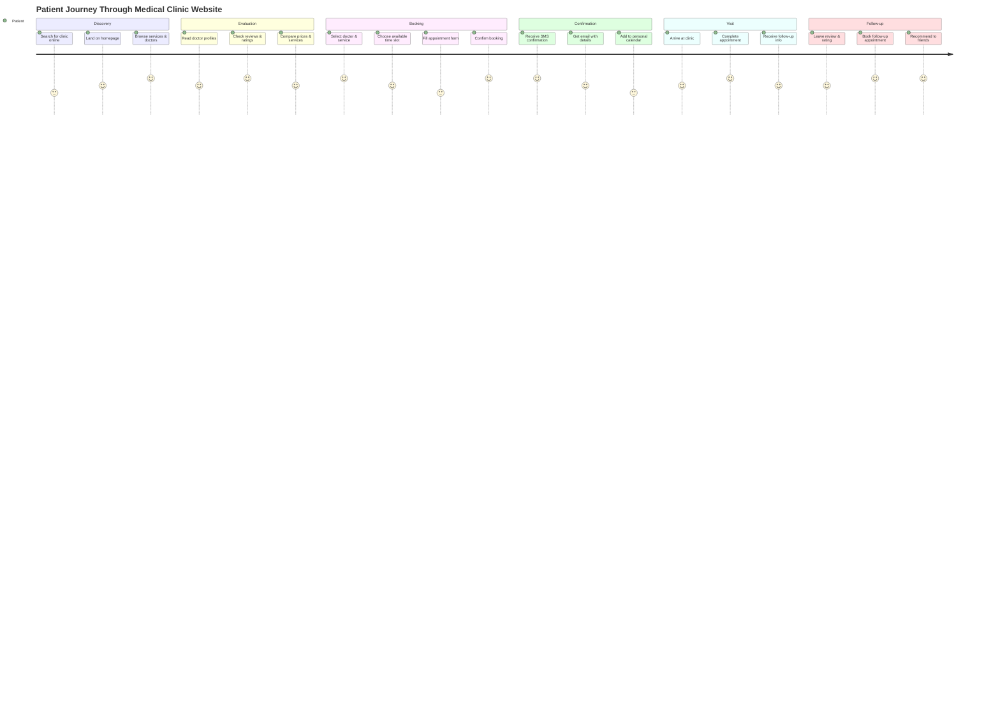
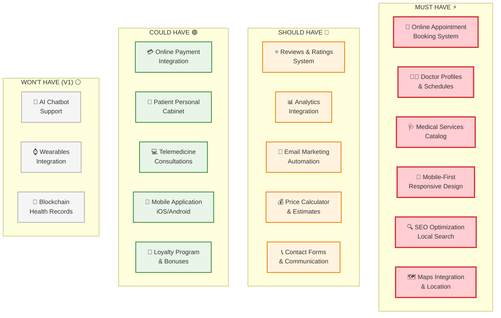
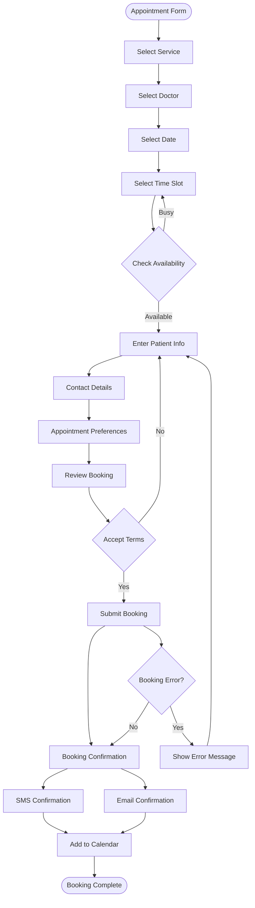
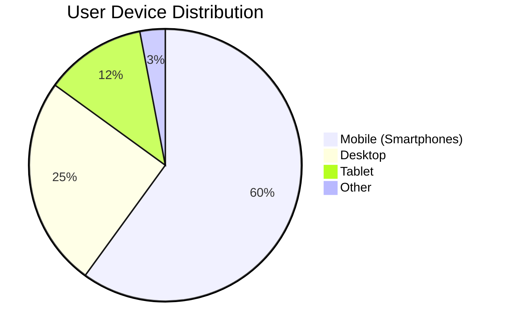
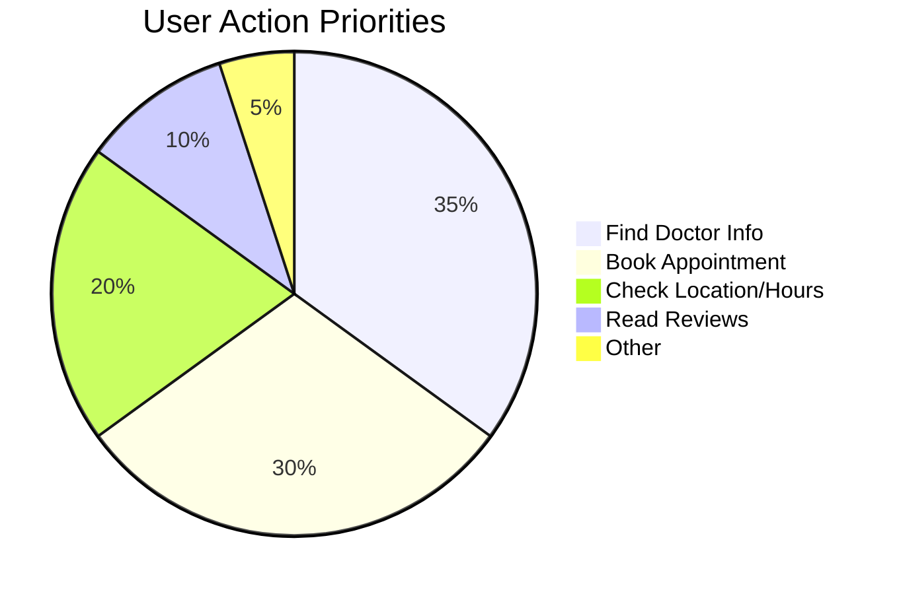
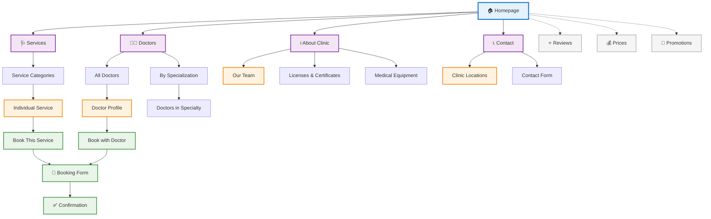
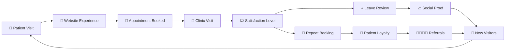

# 👤 User Journey & Features Map

> **Interactive User Journey**: Click on journey stages to explore detailed features and requirements



## 🎯 Feature Priority Matrix



## 🛤️ Detailed User Flows

### 🔍 Doctor Search & Selection Flow

```mermaid
flowchart TD
    START([Patient visits website]) --> HOMEPAGE{Homepage}
    HOMEPAGE --> SEARCH_DOCTORS[Browse Doctors]
    HOMEPAGE --> SEARCH_SERVICES[Browse Services]

    SEARCH_DOCTORS --> FILTER[Apply Filters:<br/>• Specialization<br/>• Rating<br/>• Price<br/>• Availability]
    SEARCH_SERVICES --> SERVICE_DETAIL[Service Details Page]
    SERVICE_DETAIL --> RELATED_DOCTORS[See Related Doctors]

    FILTER --> DOCTOR_LIST[Doctor List Results]
    RELATED_DOCTORS --> DOCTOR_LIST
    DOCTOR_LIST --> DOCTOR_PROFILE[Doctor Profile Page]

    DOCTOR_PROFILE --> REVIEWS_READ[Read Reviews]
    DOCTOR_PROFILE --> SCHEDULE_VIEW[View Schedule]
    DOCTOR_PROFILE --> BOOK_APPOINTMENT[Book Appointment]

    REVIEWS_READ --> BOOK_APPOINTMENT
    SCHEDULE_VIEW --> BOOK_APPOINTMENT

    BOOK_APPOINTMENT --> APPOINTMENT_FORM[Appointment Form]

    %% Styling
    classDef start fill:#e3f2fd,stroke:#1976d2
    classDef process fill:#f3e5f5,stroke:#7b1fa2
    classDef decision fill:#fff3e0,stroke:#f57c00
    classDef end fill:#e8f5e8,stroke:#388e3c

    class START start
    class HOMEPAGE decision
    class BOOK_APPOINTMENT,APPOINTMENT_FORM end
```

### 📅 Appointment Booking Flow



## 📊 Feature Impact Analysis

### 🎯 Business Goals Mapping

| Feature | Patient Flow ↑ | Call Center ↓ | Conversion ↑ | Tech Image ↑ | Priority |
|---------|----------------|---------------|--------------|--------------|----------|
| **Online Booking** | 🔴 High | 🔴 High | 🔴 High | 🔴 High | MUST |
| **Doctor Profiles** | 🟡 Medium | 🟡 Medium | 🔴 High | 🟡 Medium | MUST |
| **Mobile Design** | 🔴 High | 🟡 Medium | 🔴 High | 🔴 High | MUST |
| **Reviews System** | 🟡 Medium | 🟢 Low | 🔴 High | 🟡 Medium | SHOULD |
| **Price Calculator** | 🟢 Low | 🟡 Medium | 🟡 Medium | 🟡 Medium | SHOULD |
| **Online Payments** | 🟢 Low | 🟡 Medium | 🟡 Medium | 🔴 High | COULD |
| **Telemedicine** | 🔴 High | 🔴 High | 🟡 Medium | 🔴 High | COULD |

### 📱 User Device & Behavior Analysis





## 🎨 Page Hierarchy & Navigation



## 🔄 User Feedback Loop



## 📋 Feature Requirements Summary

### Core Functionality Requirements
- **Appointment Booking**: Real-time availability, conflict prevention, automated confirmations
- **Doctor Profiles**: Photos, credentials, specializations, patient reviews, schedule integration
- **Service Catalog**: Detailed descriptions, pricing, duration, preparation instructions
- **Mobile Experience**: Touch-friendly interface, fast loading, offline capability

### Integration Requirements
- **SMS Notifications**: Booking confirmations, reminders, updates
- **Email System**: Appointment details, follow-up communications, newsletters
- **Maps Integration**: Clinic locations, directions, parking information
- **Analytics**: User behavior tracking, conversion measurement, A/B testing

### Content Management
- **Wagtail CMS**: Easy content updates, SEO optimization, media management
- **Multi-language Support**: Optional Russian/English content
- **Blog System**: Health articles, clinic news, doctor insights

## 🔗 Related Documentation

- [🎨 UX Design Requirements](./design/ux_design_requirements.md) - Detailed UI/UX specifications
- [🏗️ Technical Architecture](./technical/technical_architecture.md) - System implementation details
- [📊 Business Brief](./business/brief.md) - Business requirements and goals
- [📋 Project Data](./business/project_data.json) - Machine-readable specifications

---

> **Interactive Navigation**: Click on feature nodes in the diagrams above to explore detailed technical documentation and implementation requirements for each component of the user journey.