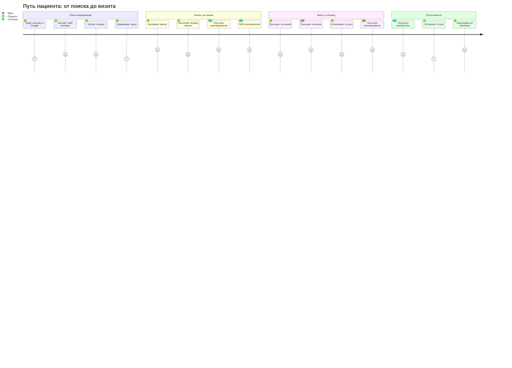
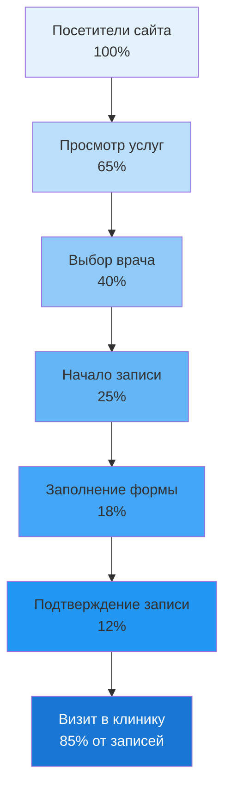

# 👤 Пользователи и их потребности

## 👥 Персоны пользователей

### 👩 Анна, 32 года - Молодая мама
**Профиль:** Работающая мама с маленьким ребенком, ценит время и удобство
**Устройства:** Смартфон (80%), планшет (20%)
**Болевые точки:** Нехватка времени, нужны быстрые решения

**Цели:**
- Быстро записаться к педиатру
- Получить напоминания о приеме
- Посмотреть отзывы о врачах
- Узнать стоимость услуг

### 👨 Михаил, 45 лет - Бизнесмен
**Профиль:** Занятой руководитель, плотный график, готов платить за премиум-сервис
**Устройства:** ПК (60%), смартфон (40%)
**Болевые точки:** Сложность планирования, очереди, потеря времени

**Цели:**
- Записаться к лучшим специалистам
- Минимум времени на ожидание
- Онлайн-оплата услуг
- Интеграция с календарем

### 👵 Елена, 62 года - Пенсионерка
**Профиль:** Пожилой пользователь, предпочитает простые интерфейсы
**Устройства:** Телефон (70%), компьютер с помощью (30%)
**Болевые точки:** Сложность технологий, боязнь ошибок

**Цели:**
- Простой способ записаться
- Подтверждение по телефону
- Понятная навигация по сайту
- Информация о льготах

### 👨‍⚕️ Доктор Иванов - Врач-терапевт
**Профиль:** Врач с опытом, нужны инструменты для эффективной работы
**Устройства:** ПК в кабинете, планшет
**Болевые точки:** Бумажная работа, путаница в расписании

**Цели:**
- Управлять своим расписанием
- Видеть информацию о пациентах
- Сократить административную работу
- Получать отзывы пациентов

## 🗺️ Путь пользователя (Customer Journey)



## 📊 Матрица приоритизации функций

| Функция | Важность для бизнеса | Важность для пользователей | Сложность разработки | Приоритет |
|---------|---------------------|---------------------------|---------------------|-----------|
| **Онлайн-запись на прием** | Критично | Высокая | Средняя | Must Have |
| **Каталог врачей с профилями** | Высокая | Высокая | Низкая | Must Have |
| **Адаптивный дизайн** | Высокая | Высокая | Низкая | Must Have |
| **SMS уведомления** | Высокая | Средняя | Средняя | Must Have |
| **Система отзывов** | Средняя | Высокая | Низкая | Should Have |
| **Интеграция с картами** | Средняя | Средняя | Низкая | Should Have |
| **Онлайн-платежи** | Высокая | Средняя | Высокая | Could Have |
| **Личный кабинет пациента** | Средняя | Средняя | Высокая | Could Have |
| **Телемедицина** | Низкая | Низкая | Очень высокая | Won't Have |

## 📱 Точки контакта

### 🌐 Веб-сайт
Основной канал информации и записи

### 📱 Мобильная версия
60%+ трафика с мобильных устройств

### 📞 Call-центр
Поддержка пожилых пользователей

### 💬 SMS
Напоминания и подтверждения

### 📧 Email
Результаты анализов, новости

### 🔍 Поисковые системы
Первичное знакомство с клиникой

### ⭐ Отзывы
Влияние на выбор клиники

### 📍 Локальный поиск
Поиск "клиника рядом"

## 📈 Воронка конверсии



### Целевые показатели конверсии:
- **65%** изучают услуги
- **12%** целевая конверсия в запись
- **85%** приходят на прием
- **10%** итоговая конверсия

## 🎯 Бизнес-цели и KPI

### Ожидаемые результаты через 6 месяцев:

**+30%** - Увеличение количества записей онлайн
**8-12%** - Конверсия сайта в запись на прием
**+40%** - Рост органического трафика
**60%** - Снижение нагрузки на call-центр
**< 3 сек** - Время загрузки страниц
**4.5+** - Средняя оценка пользователей

## 📱 Пользовательские сценарии

```mermaid
graph TD
    Start[Пользователь заходит на сайт] --> Search{Что ищет?}

    Search -->|Информация о клинике| Info[Изучает разделы<br/>"О нас", "Услуги"]
    Search -->|Конкретного врача| Doctor[Каталог врачей]
    Search -->|Записаться на прием| Booking[Форма записи]

    Info --> Decision{Устраивает?}
    Doctor --> DoctorProfile[Профиль врача]
    DoctorProfile --> Reviews[Читает отзывы]
    Reviews --> BookDoctor[Записаться к врачу]

    Decision -->|Да| Booking
    Decision -->|Нет| Exit[Покидает сайт]

    Booking --> SelectService[Выбор услуги]
    BookDoctor --> SelectService
    SelectService --> SelectTime[Выбор времени]
    SelectTime --> FillForm[Заполнение данных]
    FillForm --> Confirm[Подтверждение]
    Confirm --> SMS[SMS-уведомление]
    SMS --> Visit[Визит в клинику]

    style Start fill:#e3f2fd
    style Booking fill:#c8e6c9
    style Confirm fill:#4caf50,color:#ffffff
    style Visit fill:#2196f3,color:#ffffff
    style Exit fill:#ffcdd2
```